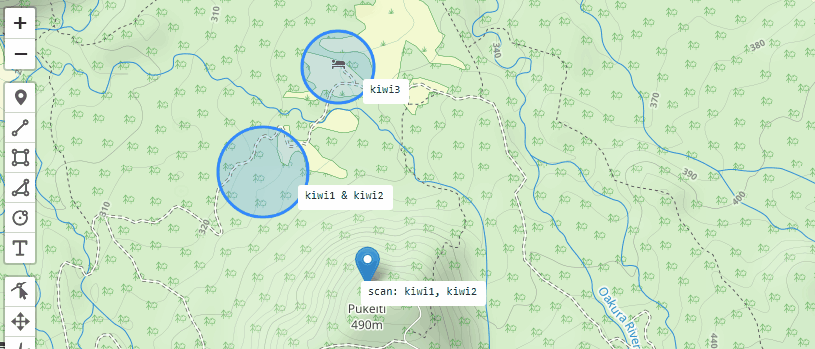
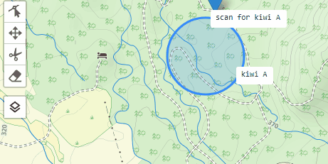
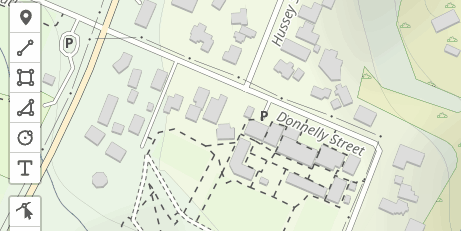
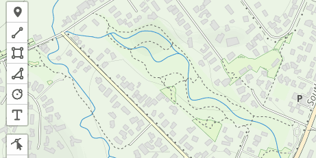

# mapannotate

The goal is to create a map that can be drawn on (or annotated) and those changes saved. Then at a later date the annotations can be edited/removed/updated. 

Often people take a screenshot of a map, then use a drawing application to mark points of interest on it. That screenshow with drawings on it can then be distributed as needed. 
However, if those points of interest change location then the whole thing needs to be redone from scratch as the annotations are part of the image and cannot be edited.

A use-case is tracking the locations of kiwis and good spots to scan from to try to pick up their transmitter signals. 
A kiwi that has not yet paired up can be constantly on the move and changing it's location. 
This can mean the creation of a lot of maps to track their locations to keep everyone aware of the changes. 
Being able to move and edit the annotations hopefully reduces the work involved in keeping everyone up-to-date with their last known locations.

This is deployed at vercel here:

https://mapannotate.vercel.app/map.html?key=test

It would be great if you didn't put cuss words on it.

This is an express app using leaflet.js to do the map stuff, geoman.js to do drawing tools, vercel to host, and a postgres db from neon.

You can change layers:

You can do various shapes or whatever:

